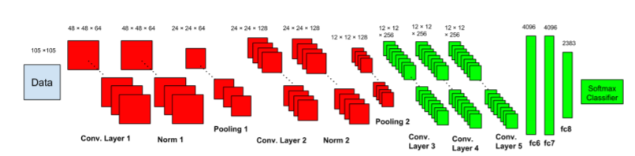

# Font Type Recognition Using deep learning 

Adobe.Inc is developed an AI reserch about font detection using the deep learning and the CNN, and they called it DeepFont [Paper](https://arxiv.org/pdf/1507.03196v1.pdf)

- Building the CNN model using Tensorflow fram work and we use the Keras library to create the layers.
- trained the model on AdobeVFR Dataset which contains 2383 Font Categories 
- trained the model on  

#### Dataset:
    Since AdobeVFR Dataset [datalink](https://www.dropbox.com/sh/o320sowg790cxpe/AADDmdwQ08GbciWnaC20oAmna?dl=0) is huge in size and contains lot of font categories . We created custom dataset based upon required font patches using **TextRecognitionDataGenerator** [github](https://github.com/Belval/TextRecognitionDataGenerator). The sample folder will be available in this repo.

#### Preprocessing of Dataset: 

    * **Noise**
    * **Blur**
    * **Perpective Rotation**
    * **Shading (Gradient Illumination )**
    * **Variable Character Spacing**
    * **Variable Aspect Ratio**

#### The CNN architecture 

